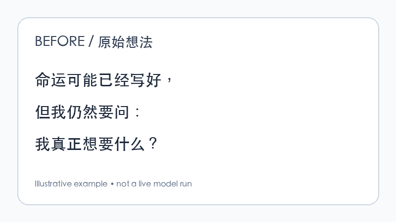

# Thought to X

[](https://github.com/zhouey314-cloud/thought-to-x/actions/workflows/ci.yml)




> Turn messy thoughts into human-sounding X posts.

我每天都会冒出很多想法。它们通常长这样：

> “AI 真正改变的可能不是知识获取，而是一个普通人第一次拥有了近乎无限的执行力……”

想法是我的。表达还很乱。

Thought-to-X 把零碎想法、语音转写、随手记录和半成品观点整理成可以发布到 X 的内容，但不把你的思考换成通用 AI 文案。

**Idea First. AI Second.**

## 它解决什么

- **痛点：** 脑子里有很多想法，却总是写不出来。
- **方案：** 先提取真实思想，再组织结构、优化 X 阅读体验、去掉 AI 味。
- **区别：** AI 负责表达，思想仍然属于你。

```text
Your Thought
     ↓
Extract the real idea
     ↓
Structure
     ↓
X Content Optimization
     ↓
De-AI
     ↓
Your Post
```

## Demo：Before / After

**Before**

> 每个人自己的命运从出生那一刻可能就已经定好，就像电影每个时间点时间线都存在，但是安于现状还是应该问自己想要什么……

**After**

> 我有时会觉得，人的命运也许从出生那一刻就已经存在了。像一部已经拍完的电影，我们只是依次走到每个时间点。
>
> 但这并不让我想躺平。恰恰相反，我还是会问自己：我真正想要什么？如果现在的生活就是内心的选择，那很好；如果不是，就应该往想去的方向走。
>
> 命运是否写好，我不知道。但至少在走过它的时候，我想尽量真实一点。

它没有替作者创造新思想，只把原本存在的“命运可能既定”与“人仍要主动选择”说清楚了。完整过程见 [destiny-example.md](examples/destiny-example.md)。

## Quick Start

这个仓库首先是 **Portable AI Skill**，其次才是 CLI 软件。完全不需要 API Key 也有价值。

### 1. Codex

```text
Read SKILL.md and process the following raw thought:

[粘贴你的想法]
```

### 2. Claude Code

```text
Read SKILL.md. Keep my idea and voice, then turn this into an X post:

[粘贴你的想法]
```

### 3. ChatGPT / Claude

复制 [`prompts/master.md`](prompts/master.md) 和它引用的模块提示词到对话中，再附上原始想法。也可以直接上传整个仓库，让模型读取 `SKILL.md`。

## CLI

Python 3.11+：

```bash
python -m pip install -e .
python -m thought_to_x input.txt --prompt-only
thought-to-x "我的一个想法……" --mode rewrite --length auto --output final-only --prompt-only
```

`--prompt-only` 会组装完整工作流，不调用任何 API。连接 OpenAI-compatible API 时：

```bash
cp .env.example .env
# 将变量加载到你的 shell 后：
thought-to-x input.txt --mode polish --length medium
```

项目不会读取或提交 `.env`；核心逻辑也不绑定某一家模型。当前适配器位于 `src/thought_to_x/providers/`。

运行测试（零额外测试框架依赖）：`PYTHONPATH=src python -m unittest discover -s tests -v`。

## 四种模式

| 模式 | 用途 |
|---|---|
| `polish` | 原文已经不错，只做局部润色 |
| `rewrite` | 保留观点，重建结构 |
| `expand` | 展开碎片中已经存在的含义，不编造事实 |
| `distill` | 把长输入蒸馏成一个完整观点 |

长度支持 `short`、`medium`、`long`、`auto`，默认 `auto`。输出支持完整结果或 `--output final-only`。

## How It Works

工作流固定按思想保真顺序运行：

```text
Normalize → Extract Intent → Find Core Insight → Identify Tension
→ Build Argument → Preserve Voice → X Content Optimization
→ De-AI → Quality Review
```

每一步的输入、输出和边界见 [`workflows/thought-to-x.md`](workflows/thought-to-x.md)。模块化提示词位于 [`prompts/`](prompts/)，因此可以单独改进某一阶段，而不用维护一条巨型 Prompt。

评分满分 100：思想保留 20、Hook 15、洞察 15、真人声音 20、逻辑 10、可读性 10、分享性 10。思想保留或真人声音低于 15，或出现虚构事实、虚构经历、改变立场，直接失败。

## Style Profile

个人风格配置在 [`config/style-profile.yaml`](config/style-profile.yaml)，控制语言、语气、偏好、避用模式和格式。

> Fork 之后，只要修改 `style-profile.yaml`，就可以把这个 Skill 变成自己的 X Writer。

还可以持续把自己真正喜欢的历史文章放进 [`examples/liked-posts.md`](examples/liked-posts.md)。它们只用于学习语气、节奏、用词和结构倾向；不会复制句子，也不会把旧观点塞进新文章。

## Examples

- [命运与选择](examples/destiny-example.md)：完整九阶段过程
- [AI 与执行力](examples/ai-example.md)：从半个观点展开，但不编造数据
- [职业选择](examples/career-example.md)：蒸馏混乱的个人反思

## Philosophy

1. **Idea First**：先确认作者究竟在说什么。
2. **Preserve Voice**：像这个人想清楚后写出来的，而不是 AI 根据主题另写一篇。
3. **Human > AI**：去掉机械排比、空洞升华、万能鸡汤和模板化留白。
4. **No Fabrication**：不编数据、不编经历、不替作者升级立场。

## Roadmap

- **v0.2** — Personal writing memory
- **v0.3** — Post performance feedback
- **v0.4** — Multiple writing personas
- **v0.5** — X draft integration

v0.1 不自动发布 X，先把思想加工系统做好。

## Contributing

欢迎提交新的真实案例、Provider Adapter、去 AI 检测规则或工作流改进。请先阅读 [`CONTRIBUTING.md`](CONTRIBUTING.md)。

## GitHub About

**Description:** Turn messy thoughts into human-sounding X posts. Idea first, AI second.

**Topics:** `ai` `x` `twitter` `writing` `ai-writing` `skill` `agent` `workflow` `content-creation` `prompt-engineering` `creator-tools`

MIT License · v0.1.0
